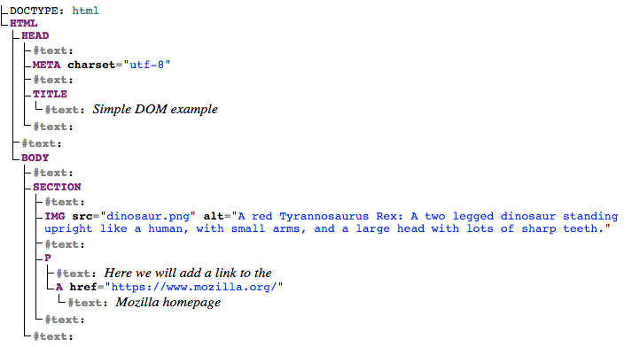

# Document Object Model (DOM)

DOM - a set of APIs for controlling HTML and styling information that makes heavy use of the _Document_ object.

Prerequsites: HTML, CSS, JS - including JS objects;
Objective: To gain familiarity with the core DOM APIs, and other APIs.

Browsers have moving parts many of them can't be controlled or manuipulated by web developer using JS. Browsers
are locked down for centring around secutiry (accesses etc.). Despite the limitations, Web APIs still give access
to lot of functionality.There are a few really obvious bits you'll reference regularly in your code — consider
the following diagram represents the main parts of a browser directly involved in viewing web pages:


- The _Navigator_ represents the state and identity of the browser (i.e. the user-agent) as it exists on the web.
  In JS, this is represented by the _Navigator_ object. You can use this object to retrieve things like: - user's preferred language; - a media stream from the user's webcam, etc.

- The _Window_ is a browser tab that a web page is loaded into; this is represented in JS by the _Window_ object.
  Using methods available on this objet you can do things like return the widnow`s size (like Window.innerWidth and
  Widnow.innerHeight), manipulate the document loaded into that window, store data specific to that document on the
  client-side (for example using a local database or other storage mechanism), attach an event handler to the current
  window, and more.

- The _Document_ (represented by the DOM in browsers) is the actual page loaded into the window, and is represented
  in JS by the _Document_ object. you can use this object to return and manipulate information on the HTML and CSS
  that comprises the document, for exmaple get a reference to an element in the DOM, change its text content, apply new
  styles to it, create new elements and add them to the current element as childern, or even delete it altogether.

## The DOM

Document loaded in each on of your browser tabs is represented by document object model. This is a 'tree structure'
representation created by the browser that enables the HTML structure to be easily accessed by progrmming languages -
for example the browser itself uses it to apply styling and other information to the correct elements as it renders a page,
and developers like you can manipulate the DOM with JS after the page has been rendered.

Here an example of HTML:

```
<!doctype html>
<html lang="en-US">
  <head>
    <meta charset="utf-8" />
    <title>Simple DOM example</title>
  </head>
  <body>
    <section>
      
      <p>
        Here we will add a link to the
        <a href="https://www.mozilla.org/">Mozilla homepage</a>
      </p>
    </section>
  </body>
</html>
```

Here the DOM on the other hand looks like this:



Note: This DOM tree diagram was created using Ian Hickson's Live DOM viewer [Live DOM viewer](https://software.hixie.ch/utilities/js/live-dom-viewer/).

Each entry in the tree is called a node. You can see in the diagram above that some nodes represent elements (identified as HTML, HEAD, META and so on) and others represent text (identified as #text). There are other types of nodes as well, but these are the main ones you'll encounter.

Nodes are also referred to by their position in the tree relative to other nodes:

- _Root node_: The top node in the tree, which in the case of HTML is always the _HTML_ node (other markup vocabularies like SVG and custom XML will have different root elements).

- _Child node_: A node directly inside another node. For example, IMG is a child of _SECTION_ in the above example.

- _Descendant node_: A node anywhere inside another node. For example, IMG is a child of _SECTION_ in the above example, and it is also a descendant. IMG is not a child of BODY, as it is two levels below it in the tree, but it is a descendant of _BODY_.

- _Parent node_: A node which has another node inside it. For example, _BODY_ is the parent node of _SECTION_ in the above example.

- _Sibling nodes_: Nodes that sit on the same level in the DOM tree. For example, _IMG_ and _P_ are siblings in the above example.
