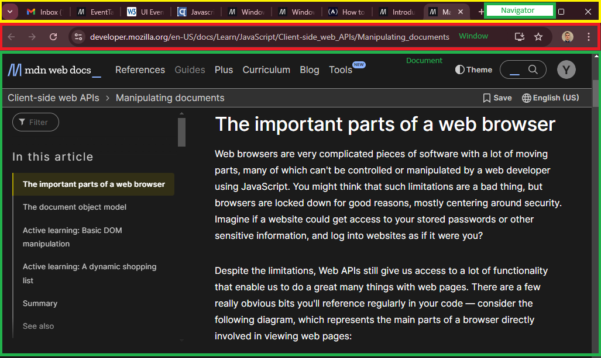

# Document Object Model (DOM)

DOM - a set of APIs for controlling HTML and styling information that makes heavy use of the _Document_ object.

Prerequsites: HTML, CSS, JS - including JS objects;
Objective: To gain familiarity with the core DOM APIs, and other APIs.

Browsers have moving parts many of them can't be controlled or manuipulated by web developer using JS. Browsers
are locked down for centring around secutiry (accesses etc.). Despite the limitations, Web APIs still give access
to lot of functionality.There are a few really obvious bits you'll reference regularly in your code — consider
the following diagram represents the main parts of a browser directly involved in viewing web pages:

